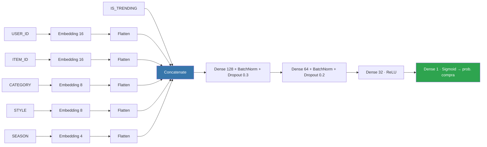

<div align="center">

# 🎯 Sistema de Recomendación con Deep Learning

### Red neuronal con *embeddings* que predice la probabilidad de compra y genera recomendaciones personalizadas

[](https://www.python.org/)
[](https://www.tensorflow.org/)
[](https://scikit-learn.org/)
[](https://keras.io/)

</div>

---

Sistema de recomendación basado en **Deep Learning supervisado**. Una red neuronal con capas de *embedding* aprende representaciones densas de usuarios, productos y contexto (categoría, estilo, temporada, tendencia) para predecir la probabilidad de que un usuario compre un producto, y a partir de ahí generar recomendaciones **Top-K** personalizadas. Incluye además un mecanismo de respaldo para el problema de **inicio en frío** (*cold start*).

## 📋 Objetivo

Entrenar una red en **TensorFlow / Keras (API funcional)** que mapee variables categóricas a espacios vectoriales continuos mediante *embeddings*, capturando afinidades complejas usuario–producto para estimar la conversión de clic a compra.

## 📊 Dataset

Una sola tabla con interacciones históricas usuario–producto.

| Columna | Tipo | Descripción |
|---|---|---|
| `USER_ID` | Int (cat.) | Identificador del usuario |
| `ITEM_ID` | Int (cat.) | Identificador del producto |
| `CATEGORY` | String | Tipo de prenda (`shoes`, `tshirt`, `jacket`, `dress`, `bag`…) |
| `STYLE` | String | Estilo (`casual`, `elegant`, `sport`, `urban`) |
| `SEASON` | String | Temporada (`summer`, `winter`, `spring`, `autumn`) |
| `IS_TRENDING` | Binario | 1 si el producto es tendencia, 0 si no |
| `PURCHASE` | Binario | **Target** — 1 si hubo compra, 0 si no |

> [!NOTE]
> El notebook carga el CSV desde una ruta de Kaggle
> (`/kaggle/input/.../recomendaciones.csv`). Ajusta la ruta de la celda de carga
> si lo ejecutas en local.

### Hallazgos del EDA

- **Clases desbalanceadas:** ratio de conversión ≈ **25,4 %** (sesgo hacia la no-compra).
- **Las tendencias importan:** los productos *trending* se compran bastante más (≈ 36,9 %) que los no-trending (≈ 20,5 %), señal de que `IS_TRENDING` tiene poder predictivo.
- **Densidad por usuario:** ~25 interacciones de media por usuario (rango ~16–41).

## 🧠 Arquitectura del modelo



| Componente | Detalle |
|---|---|
| Embeddings | `USER_ID`→16, `ITEM_ID`→16, `CATEGORY`→8, `STYLE`→8, `SEASON`→4 |
| Fusión | `Flatten` de cada embedding + `Concatenate` con la señal `IS_TRENDING` |
| Capas densas | 128 → 64 → 32, con `BatchNormalization` y `Dropout` (0.3 / 0.2) en las dos primeras |
| Salida | `Dense(1, sigmoid)` → probabilidad en `[0, 1]` |

## ⚙️ Entrenamiento y regularización

| Técnica | Configuración |
|---|---|
| Optimizer / Loss | `adam` / `binary_crossentropy` |
| Métricas | `accuracy`, `AUC` |
| Pesos de clase | `{0: 1.0, 1: √(neg/pos)}` ≈ `{0: 1.0, 1: 1.71}` (raíz de la proporción inversa, suaviza el desbalanceo) |
| `EarlyStopping` | `patience=8`, restaura los mejores pesos según `val_loss` |
| `ReduceLROnPlateau` | `factor=0.2`, `patience=3`, `min_lr=1e-4` |
| Split | 80 / 20, estratificado, `random_state=42` |
| Reproducibilidad | Semilla `42` en Python, NumPy y TensorFlow |

## 📈 Resultados (test, 20 % de los datos)

| Métrica | Valor |
|---|---|
| Loss (BCE) | 0,5758 |
| Accuracy | 72,60 % |
| AUC (ROC) | 0,6058 |

> [!IMPORTANT]
> El AUC ronda **0,61**: mejor que el azar (0,5) pero modesto. Es un resultado
> honesto para un **dataset sintético** con pocas features. No es un modelo
> "de producción", sino una demostración correcta de la arquitectura y el flujo.

## 🎯 Motor de recomendación

1. **Recomendación personalizada** — para un `USER_ID` conocido, se cruza al usuario con todo el catálogo (excluyendo lo que ya compró), se predice la probabilidad de compra de cada producto y se devuelven los **Top-K** con mayor score.
2. **Cold start** — para un usuario nuevo sin historial (sin embedding entrenado), se cae a una heurística que ordena el catálogo por `purchase_rate + is_trending · 0.2` y recomienda los más populares/trending.

## 🛠️ Requisitos

```
python >= 3.10
tensorflow >= 2.15
scikit-learn
pandas
numpy
matplotlib
seaborn
```

```bash
pip install tensorflow scikit-learn pandas numpy matplotlib seaborn
```

## ▶️ Uso

1. Coloca el CSV y ajusta la ruta en la celda de carga (`pd.read_csv(...)`).
2. Ejecuta el notebook de arriba a abajo: EDA → encoding → split → modelo → entrenamiento → evaluación → recomendaciones.

## 🚀 Mejoras posibles

- Probar con un dataset real (MovieLens, RetailRocket).
- Añadir features de usuario (edad, presupuesto…).
- Arquitecturas más expresivas (Wide & Deep, Neural Collaborative Filtering).
- Métricas de ranking (NDCG@K, MAP) además de AUC.

---

<div align="center">
<sub>Proyecto de demostración — arquitectura embeddings + capas densas para recomendación.</sub>
</div>
